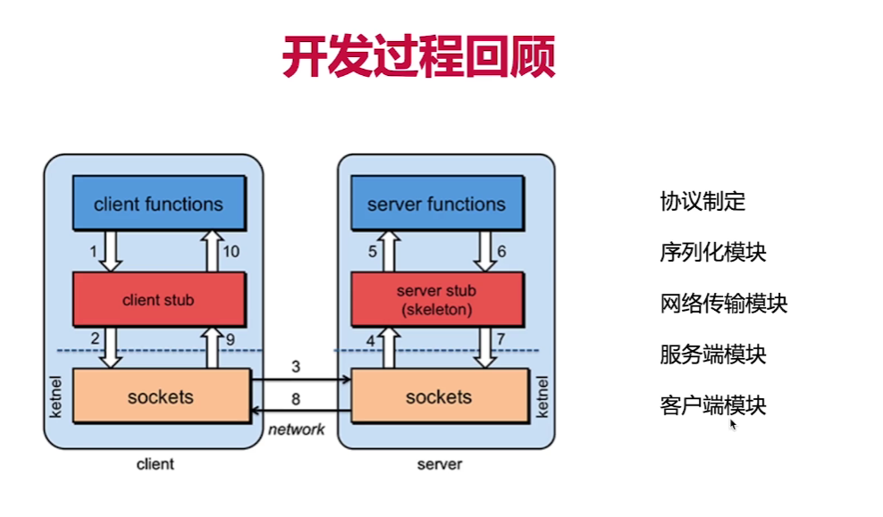

本项目使用java实现了基于Http，servlet，jetty的rpc服务

来源于课程https://www.imooc.com/video/21091

example为使用样例
因为没有注册中心无法发现服务，所以写死服务端口为3000端口

关于jetty： https://www.cnblogs.com/wade-luffy/p/5970436.html
https://blog.csdn.net/guoxilen/article/details/22756551

